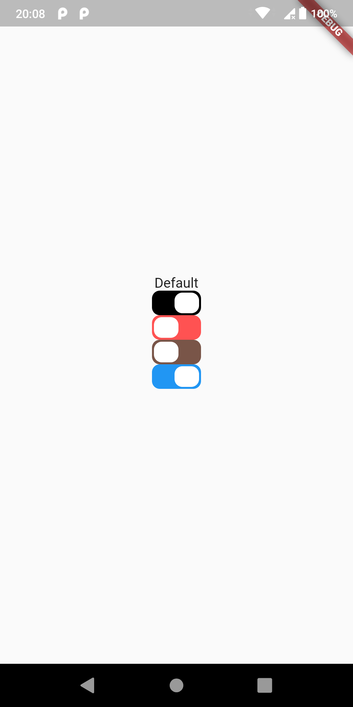

# Square

This  package contains a single widget. A square switch, in future i pretend to add some other widgets made for me.

# Getting started

To use it you need add as dependency to your project.

``` dart
dependencies:
    square: ^0.0.2
```

# Importing

```dart
import 'package:square/square.dart';
```

# Usage
Make sure importing the library before try to use it
```dart
import 'package:square/square.dart';
        .
        .
        .
SquareSwitch(
    activeTrackColor: Colors.blue,
    inactiveTrackColor: Colors.cyan,
    onChange: () {},
),
```
